<div align="center">

# 🎓 VTU Performance Analyzer

### *Your AI-Powered Academic Success Partner*

<br/>


<br/>

**Stop calculating grades manually. Start achieving more.**

*Upload your VTU result PDF → Get instant SGPA/CGPA → Receive AI-powered study recommendations*

<br/>

[](https://reactjs.org/)
[](https://flask.palletsprojects.com/)
[](https://deepmind.google/technologies/gemini/)
[](https://scikit-learn.org/)

<br/>

[**🚀 Get Started**](#-quick-start) · [**✨ Features**](#-why-choose-vtu-performance-analyzer) · [**🛠️ Tech Stack**](#%EF%B8%8F-built-with-modern-technology)

---

</div>

<br/>

## 😫 The Problem

Every VTU student knows the struggle:

- 📝 **Manual calculations** — Spending hours computing SGPA/CGPA from result PDFs
- 🤷 **No guidance** — Knowing you failed, but not knowing *how to improve*
- 📉 **No visibility** — Unable to track academic trends across semesters
- 🔮 **Uncertainty** — No idea what to expect next semester

<br/>

## 💡 The Solution

**VTU Performance Analyzer** transforms your academic journey with intelligent automation:

<div align="center">

| Upload | Analyze | Predict | Succeed |
|:------:|:-------:|:-------:|:-------:|
| 📄 | 📊 | 🔮 | 🎯 |
| Drop your PDF | Instant SGPA/CGPA | ML-powered forecasts | AI study plans |

</div>

<br/>

---

## ✨ Why Choose VTU Performance Analyzer?

<table>
<tr>
<td width="50%">

### 📄 Zero Manual Entry
**Drag. Drop. Done.**

Our intelligent PDF parser extracts marks, subject codes, and credits automatically. No more typing. No more errors.

</td>
<td width="50%">

### 🤖 AI Study Advisor
**Personalized guidance powered by Google Gemini**

"How do I clear Engineering Maths?" — Get specific, actionable study strategies based on YOUR performance data.

</td>
</tr>
<tr>
<td width="50%">

### 📈 Visual Analytics
**See your academic story unfold**

Beautiful, interactive charts reveal your performance trends. Identify patterns. Celebrate growth. Spot areas for improvement.

</td>
<td width="50%">

### 🔮 Predictive Intelligence
**Know your future before it happens**

Machine learning analyzes your historical data to forecast next semester's SGPA. Plan ahead. Stay prepared.

</td>
</tr>
<tr>
<td width="50%">

### ⚡ Lightning Fast
**Results in seconds, not hours**

What used to take an entire evening now takes less than 5 seconds. Upload → Analyze → Insights. That simple.

</td>
<td width="50%">

### 🔒 Privacy First
**Your data stays yours**

PDFs are processed in-memory and immediately discarded. No storage. No tracking. Complete peace of mind.

</td>
</tr>
</table>

<br/>

---

## 🎬 How It Works

```mermaid
flowchart LR
    A[📄 UPLOAD<br/>Result PDF] --> B[🔍 PARSE<br/>Extract Marks<br/>& Credits]
    B --> C[📊 ANALYZE<br/>Calculate SGPA/CGPA<br/>+ Trends]
    C --> D[🤖 ADVISE<br/>AI Tips +<br/>Predictions]

    style A fill:#4F46E5,stroke:#3730A3,color:#fff
    style B fill:#7C3AED,stroke:#5B21B6,color:#fff
    style C fill:#EC4899,stroke:#BE185D,color:#fff
    style D fill:#F59E0B,stroke:#D97706,color:#fff
```

<div align="center">



</div>

<br/>

<div align="center">

| Step | What Happens | Technology |
|:----:|:-------------|:-----------|
| **1️⃣** | **Upload** your VTU result PDF via drag & drop | React Dropzone |
| **2️⃣** | **Parse** — Extract subject codes, marks, credits automatically | PyMuPDF + Regex |
| **3️⃣** | **Calculate** — Compute SGPA/CGPA using VTU 2022 scheme formula | Python + Pandas |
| **4️⃣** | **Visualize** — Generate interactive performance trend charts | Chart.js |
| **5️⃣** | **Predict** — Forecast next semester's SGPA using ML | Scikit-Learn |
| **6️⃣** | **Advise** — Get personalized study tips for weak subjects | Google Gemini AI |

</div>

<br/>

### 🔧 Under the Hood

<table>
<tr>
<td width="50%">

#### 📄 PDF Engine
**PyMuPDF + Regex**

Extracts subject codes (e.g., `BCS401`), marks, and results with surgical precision from official VTU result PDFs.

</td>
<td width="50%">

#### 🧮 Grade Calculator
**VTU 2022 Scheme**

Applies the official weighted formula:

`SGPA = Σ(Credits × Grade Points) / Σ(Total Credits)`

</td>
</tr>
<tr>
<td width="50%">

#### 🔮 Prediction Model
**Scikit-Learn Linear Regression**

Analyzes your historical SGPA data across semesters to forecast future academic performance.

</td>
<td width="50%">

#### 🤖 AI Study Advisor
**Google Gemini 2.5 Flash**

Identifies weak subjects and generates specific, actionable recovery strategies tailored to your performance.

</td>
</tr>
</table>

<br/>

---

## 🛠️ Built With Modern Technology

<div align="center">

### Frontend
| Technology | Purpose |
|------------|---------|
|  | Dynamic, responsive UI |
|  | Beautiful data visualizations |
|  | Modern, clean styling |

### Backend
| Technology | Purpose |
|------------|---------|
|  | Fast, lightweight API server |
|  | Core processing engine |
|  | Generative AI capabilities |

</div>

<br/>

---

## 🚀 Quick Start

### Prerequisites

- ✅ Python 3.10+
- ✅ Node.js 18+
- ✅ [Google Gemini API Key](https://makersuite.google.com/app/apikey)

### Installation

**1️⃣ Clone the repository**
```bash
git clone https://github.com/electrifiedchan/vtu-performance-analyzer.git
cd vtu-performance-analyzer
```

**2️⃣ Set up the Backend**
```bash
cd backend
python -m venv venv

# Windows
.\venv\Scripts\activate

# Mac/Linux
source venv/bin/activate

pip install -r requirements.txt
```

**3️⃣ Configure Environment**

Create a `.env` file in the `backend/` directory:
```env
GEMINI_API_KEY=your_api_key_here
```

**4️⃣ Set up the Frontend**
```bash
cd ../frontend
npm install
```

**5️⃣ Launch the Application**

*Terminal 1 — Backend:*
```bash
cd backend
python app.py
```

*Terminal 2 — Frontend:*
```bash
cd frontend
npm start
```

**6️⃣ Open your browser**

Navigate to `http://localhost:3000` and upload your first result PDF! 🎉

<br/>

---

## 📁 Project Architecture

```
vtu-performance-analyzer/
│
├── 🔧 backend/
│   ├── app.py              # Flask server, ML model, Gemini integration
│   ├── parser.py           # PDF parsing engine with regex patterns
│   ├── requirements.txt    # Python dependencies
│   └── .env                # API keys (git-ignored)
│
├── 🎨 frontend/
│   ├── src/
│   │   ├── components/     # Reusable UI components
│   │   ├── pages/          # Application views
│   │   └── App.js          # Root component
│   └── package.json        # Node dependencies
│
└── 📖 README.md
```

<br/>

---

## 🤝 Contributing

We welcome contributions! Whether it's:

- 🐛 Bug fixes
- ✨ New features
- 📖 Documentation improvements
- 💡 Ideas and suggestions

Feel free to open an issue or submit a pull request.

<br/>

---

<div align="center">

## 🌟 Ready to Transform Your Academic Journey?

**Stop guessing. Start achieving.**

[**⬆️ Back to Top**](#-vtu-performance-analyzer)

<br/>

---

<sub>Built with ❤️ for VTU students everywhere</sub>

<sub>Made by [@electrifiedchan](https://github.com/electrifiedchan)</sub>

<br/>


</div>
